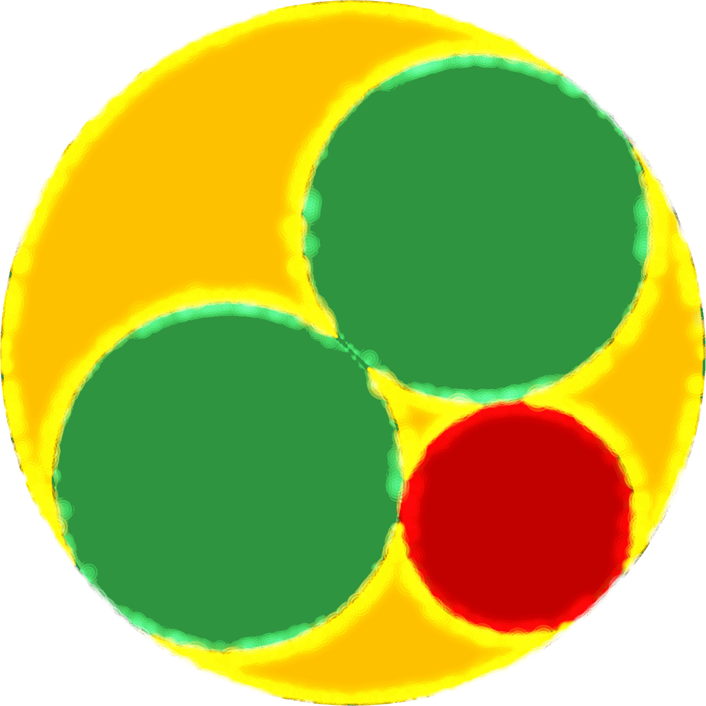

# Dndnrmn10's Gallery
This is the gallery i made for high quality videos, gif files, and more.
There is high quality videossome in the gallery, there is some videos with soundtrack on it, There is text images i made with Textcraft Pro using the fonts Mega-1, Mega-2 and Mega 3, also There is some tiltshifted files in the gallery.
I also made high-res remakes of some Textcraft styles by somebody else in Textcraft.only for Textcraft Pro users[^1][^2][^3][^4]

> Also, i have Textcraft Pro styles that i made with the Mega fonts.

## How do make high-res images up to 2048px in Glitterboo?
According to Glitterboo FAQ, the difference between the Free version and the Membership versionAlready have this version is the max image and animation download size which is 2048px in the membership version, 640x480pximage and 360pxanimation in the free version.[^5]

## Did i try all effects yet in Glitterboo?
**Yes,** i do.[^6]

### Gallery of all 20 effects of Glitterboo membership
> Animated X-Large file size only

  
  
  
  
  
   
  
  
  
  
  

## Dndnrmn-what?
**Dndnrmn10** is a short name of Dandan Romana + 10 and the orgin of the name is Wikimedia Commons, with additonal 0 on the end.

## Examples

  
   
  
  
  
  

[^1]: [Gta by Gaglioti Hires Style](https://textcraft.net/style/Dndnrmn10/gta-by-gaglioti-hire)
[^2]: [Scratch Logo Hires Style](https://textcraft.net/style/Dndnrmn10/scratch-logo-hires)
[^3]: [Golden Text Hires Style](https://textcraft.net/style/Dndnrmn10/golden-text-hires)
[^4]: [Youtube Thumbail Hires](https://textcraft.net/style/Dndnrmn10/youtube-thumbnail-hires)
[^5]: [FAQ page of Glitterboo](https://glitterboo.com/faq.php?page=membership#2)
[^6]: [FAQ page of Glitterboo](https://glitterboo.com/faq.php?page=membership#3)
